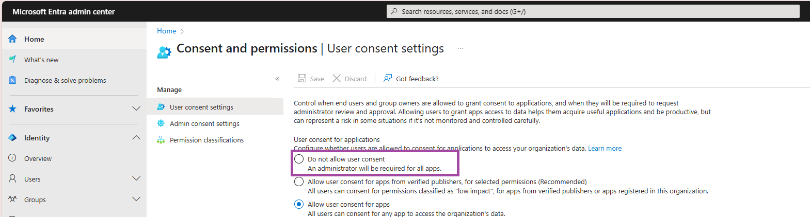
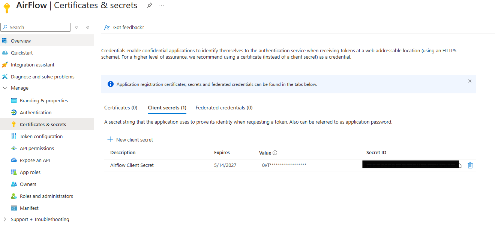
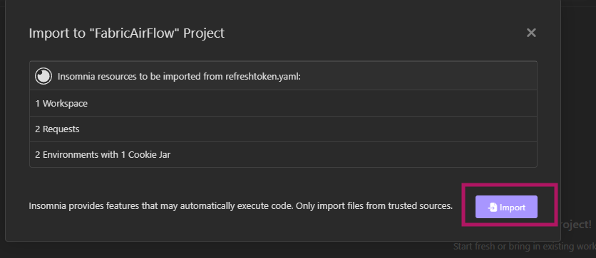
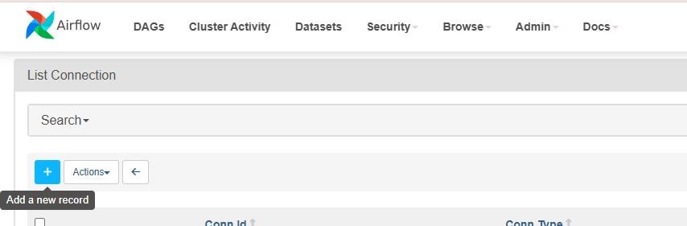
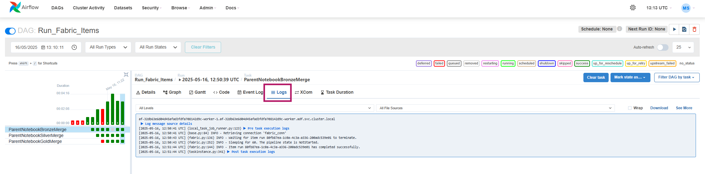

## Lessons Learned from Orchestrating Notebooks in a Medallion Architecture with Apache Airflow Job Task

While building a data project in Microsoft Fabric based on a **medallion architecture**, I structured the solution using **modular notebooks**. For each layer—**bronze, silver**, and **gold**—a **parent notebook** orchestrates the workflow and calls a **child notebook**. The parent contains a list of parameter objects that describe things like the source table, create table statements and other things. Each parameter object is passed to a child notebook which the executes whatever it needs to. And since there is one parameter object for each table that needs to be processed, there are a lot of child notebooks that need to run on each layer.

For example:

```ParentNotebookSilverBronze``` calls the  notebook ```ChildNotebookSilverBronze``` which extracts data from multiple tables in parallel, based on table names passed as parameters.

```ParentNotebookSilverMerge``` calls the  notebook ```ChildNotebookSilver``` which transforms the extracted data.

```ParentNotebookGoldMerge``` calls the  notebook ```ChildNotebookGold``` which joins the processed data into final dimension or fact tables.


During development, this modular approach worked well. I used a **DAG (Directed Acyclic Graph)** structure within each layer to control execution order.

However, once I began orchestrating the parent notebooks using a **Fabric Data Pipeline**, execution times increased unexpectedly and substantially. After researching, I learned that **notebook orchestration in Fabric can lead to performance issues** if not carefully designed. Each notebook call creates a **new compute session**, which can quickly consume **capacity units (CUs)** and slow things down—especially in modular setups. Pipelines are intuitive and visually helpful, but they **don’t always handle dependencies or session sharing efficiently.**

To improve the performance of the orchestration of my parent-child notebook setup, I began exploring Apache Airflow, which is now partially integrated into Microsoft Fabric. The Apache Airflow job allows you to define complex workflows using DAGs, giving you more control over execution order, dependencies, and resource usage. And it is a lot faster than Data Pipelines while doing so.

Apache Airflow job provides:

- A structured way to model your warehouse/lakehouse load process

- Real-time visibility into each step’s status and metrics

- Access to detailed logs and deep integration with Fabric items

It solves challenges that pipelines struggle with in larger, more complex projects.

In this post, I’ll walk you through how to set up your first Airflow DAG in Microsoft Fabric, sharing the challenges I faced and the solutions I found.


### Settings in Fabric

In the Fabric Tenant Admin Settings, make sure that you have enabled the access for service principals, otherwise you won't be able to assign access to a Service Principal (SPN) to the Workspace. 


### A Note About "User Consent Settings" in Microsoft Entra Admin Center

You may come across official [Microsoft documentation](https://learn.microsoft.com/en-us/fabric/data-factory/apache-airflow-jobs-run-fabric-item-job) suggesting that you need to enable the following setting:

**Allow user consent for apps**

This option is found under User consent settings and requires Privileged Role Administrator permissions to configure.

However, **this is not required** to run Apache Airflow jobs in Microsoft Fabric.
It works **perfectly fine without changing this setting.**

In fact, from a security standpoint, it is **strongly recommended** to **leave this setting at “Do not allow user consent”** unless there is a compelling and controlled use case.

Keep **"Do not allow user consent"** selected to maintain a secure tenant configuration.
Only adjust this if absolutely necessary and with full understanding of the risks.




### Settings in Azure

In the Azure Portal, in Entra ID, create an App Registration. 
You can follow the instructions in the [Microsoft Documentation](https://learn.microsoft.com/en-us/entra/identity-platform/quickstart-register-app?tabs=certificate)

<!-- Wir haben noch Destop App für insomnia hinzugefügt, man müsste mal testen, ob das notwendig ist. Das mit insomnia muss aber so oder so erwähnt werden, wegen dem, Refresh token. Das geht ohne ziemlich sicher nicht -->
The basic steps are:

1. Provide a name, e.g., AirFlow
2. Under *Authentication*, add a Platform, web link, with the Redirect URI set to **https://login.microsoftonline.com/common/oauth2/nativeclient**


  Furthermore under *Mobile and desktop applications* add the following redirect URI. This is needed to make Insomnia work (see later):

  ```
  https://redirect.insomnia.de
  ````

  


3. Under *Certificates and secrets*, add a *New client secret*. Beware that you will need it later, so I recommend that you save it in an Azure Key Vault or a password manager, otherwise you need to copy the **value** right away or you won't be able to access it a a later point. 




4. Under *API Permission*, add the following permissions from Microsoft Graph and Power BI Service. The latter is only necessary if you want to orchestrate Power BI related tasks with Apache Airflow later. 


5. Copy the following parameters from the created App for later use (e.g., paste it in a .txt file):

- Tenant ID
- Client ID
- Client Secret


When creating an application in Azure, a SPN is automatically created for that app. 

### Assign Permissions to App

Now that your created your application, add it as **Contributor** to your Microsoft Fabric Workspace where the Apache Airflow Job will reside. 


### Authentication

This was the part where I needed some support, as I’m not deeply familiar with setting up authentication—and that’s where Sebastian Steinau came to the rescue. 😊 

**Authentication** is the process of verifying who you are—similar to logging in with your username and password. In many modern systems, this is done through **token-based authentication**. When you authenticate, you receive an **access token**, which allows you to interact with services securely. However, this token is only valid for a short period of time.

To avoid repeated logins, a **refresh token** is used. It allows your application to **request a new access token automatically**, ensuring a seamless and secure experience without manual re-authentication.

In the context of **Apache Airflow in Microsoft Fabric**, authentication becomes especially important. Since Airflow is not a fully integrated part of Fabric, you need to configure connections and security manually. That’s why a **refresh token is required**—Airflow uses it to authenticate against Fabric on behalf of the **SPN** of the application you previously registered.

This setup ensures Airflow can execute Fabric items securely and without interruption.

The way to obtain a refresh token was using the [OAuth2 auth code flow protocol](https://learn.microsoft.com/en-us/entra/identity-platform/v2-oauth2-auth-code-flow) .

We used [Insomnia](https://insomnia.rest/download) for this. We have prepared a template [here](https://github.com/Bieine/Articles-Resources/blob/main/refreshtoken.yaml) which you can reuse using your own parameters. We hope that this saves time and headaches ;-)

1. Install the [Insomnia](https://insomnia.rest/download) client if necessary. 

2. Import the provided template refreshtoken.yaml 


  - Click on Scan.


  - Imsomnia will display which resources will be imported.

  - Click on Import. 



3. Go to the Collection *RefreshToken*. A collection contains all request pertaining to the same topic. 

The collection has two environments *Base Environment* and *YourCompany*. 

You do not have to change anything in the *Base Enviromnent*. 

In the environment *Your Company* you have to replace the value "string" with your information for:

- the tenantId
- the clientId
- the clientSecret

Remember that you saved this information earlier in a .txt file. 

To change those parameters you need to edit the environment *YourCompany*.


4. The collection has two request, a GET Request and a POST request. 

The GET request will allow us to get an authorization code, which we can use in the POST request to retrieve a refresh token. 

Go to the GET request *Get Authorization Code* >> Params. 

Since the base and your company related parameters where already provided, you'll get a URL that looks like this contaning your parameters:


https://login.microsoftonline.com/{tenantId}/oauth2/v2.0/authorize?client_id={clienbtId}&response_type=code&redirect_uri=https%3A%2F%2Fredirect.insomnia.de&response_mode=query&state=12345&scope%20=https%3A%2F%2Fapi.fabric.microsoft.com%2FItem.Execute.All%20https%3A%2F%2Fapi.fabric.microsoft.com%2FItem.ReadWrite.All%20offline_access%20openid%20profile&client_secret={clientSecret}


Copy the URL and paste it in your browser. The browser URL will be replaced with a new URL. Doing this in the browser is not ideal and I will look further how to do this entirely in Insomnia. For now it is clunky but works.

https://redirect.insomnia.de/?**code**=1.AS8AV5Uo6KfUGk-npxp-DIOHao8vDLraPVNNj5pwqbimHvovAFsvAA.AgABBAIAAABVrSpeuWamRam2jAF1XRQEAwDs_wUA9P_37KF9rUF&state=12345&session_state=004e7609-e2f8-3e80-fa3b-34fe80803747

You’ll need to copy the **authorization code**, which is the value that appears after the *code field* in the URL until the first & (ampersand) sign (right before **&state**)

This code is only needed once—after that, **Apache Airflow will use the refresh token** for all future connections.

5. Now we need to use the POST request in Insomnia. 

This time inside the POST request, go to *Body* and replace the value "string" with the authorization code that you just copied. 

Click on **Send** to send the request.


You will get a status *200* (Ok) back with the **refresh token** in the body.


 We need to extract the value of the **refresh token** for the next step. 


### Set-up in Apache Airflow 

In Fabric, create a new Airflow job in the Workspace where you added the SNP of the Application you created in Azure. 
Under *Environment configuration* check the "Enable triggers". This option allows you the usage of deferrable operators. 

Under "Apache Airflow requirements make sure to add those two plugins:

- [apache-airflow-microsoft-fabric-plugin](https://pypi.org/project/apache-airflow-microsoft-fabric-plugin/)
- [airflow-powerbi-plugin](https://pypi.org/project/airflow-powerbi-plugin/)


Now we need to create the connection between Apache Airflow and Microsoft Fabric. 

In the Apache Airflow job go to *View connections* on the top and click on it. 


You will be redirected to the Apache Airflow UI. To add a new connection go to **Admin >> Connections**


Click on the + sign to add a new record. 




Fill in the following fields:

- **Connection ID**: Choose a meaningful name (f.e. fabric_conn)
- **Connection Type:** Select Generic.
- **Login:** Enter the Client ID of the SPN of Application created in Azure.
- **Password:** Paste the refresh token obtained from the POST request in Insomnia

- **Extra:**  paste this JSON and replace the "string" with your tenand Id.

{
  "tenantId": "string",
  "scopes": "https://api.fabric.microsoft.com/Item.Execute.All https://api.fabric.microsoft.com/Item.ReadWrite.All offline_access openid profile"
}

**Remark:**

 In other Blog Posts also the *Client Secret* of the SNP was added but when I did that and run my DAG it kept failing. From the Logs I got the following information:  "Client is public so neither 'client_assertion' nor 'client_secret' should be presented". 
 The explanation is that your Azure App Registration (used in your Airflow fabric_test connection) is registered as a public client. But you're providing a client secret, which is not allowed for public clients.  So I omitted the Client Secret of the SPN and my DAG run without any issue.


After saving the new connection you might get an "500 Internal Server Error" (I got them repeatedly), refresh the page and you should see your connection. 


## Run a DAG in Fabric

To create a DAG in the Apache Airflow Job, click on **"+ New"** on the explorer. Select the folder **dags/** and provide a name for your Python file. 


I added the following content to run my parent notebooks, which again run children notebooks. However you can adapt this code to your own needs to run notebooks or pipelines. 


```
from airflow import DAG
from datetime import datetime
from apache_airflow_microsoft_fabric_plugin.operators.fabric import FabricRunItemOperator
from airflow.hooks.base_hook import BaseHook

workspace_id = "xxxxx"

with DAG(
    dag_id="Run_Fabric_Items",
    schedule_interval=None,
    start_date=datetime(2025, 5, 16),
    catchup=False,
    concurrency=20,
) as dag:

    run_notebook_bronze = FabricRunItemOperator(
        task_id="ParentNotebookBronzeMerge",
        fabric_conn_id="fabric_conn",
        workspace_id=workspace_id,
        item_id="xxxxx",
        job_type="RunNotebook",
        wait_for_termination=True,
        deferrable=False,
    )

    run_notebook_silver = FabricRunItemOperator(
        task_id="ParentNotebookSilverMerge",
        fabric_conn_id="fabric_conn",
        workspace_id=workspace_id,
        item_id="xxxxx",
        job_type="RunNotebook",
        wait_for_termination=True,
        deferrable=False,
    )

    run_notebook_gold = FabricRunItemOperator(
        task_id="ParentNotebookGoldMerge",
        fabric_conn_id="fabric_conn",
        workspace_id=workspace_id,
        item_id="xxxxx",
        job_type="RunNotebook",
        wait_for_termination=True,
        deferrable=False,
    )

    run_notebook_bronze >> run_notebook_silver >> run_notebook_gold

````

The >> at the end give the order of execution. 

Make sure to replace:

- <workspace_id> with your workspace id
- <task_id> with a chosen name for your task, does not have to be the item name
- <item_id> with the corresponding item id
- <fabric_conn> with the fabric connection created in Apache Airflow


If you do not know how to get the workspace_id or item_id, the Fabric platform forum has you covered: https://community.fabric.microsoft.com/t5/Fabric-platform/Workspace-ID/m-p/3911277


Make sure to save your DAG file in between as it is not automatically saved as compared to notebooks and you would need to define it over again. 

I then run my DAG and tadaaa it was a success and quite fast! But let me be honest, it did not work at the first trial (I'm just not that lucky person). Therefore I got a bit familiar with Apache Aiflow monitor. 


## Apache Airflow Monitor & Additional Resources 

Something I came across by following those articles

- https://www.linkedin.com/pulse/automate-your-microsoft-fabric-workloads-apache-neelakantam-kz1if/ by Sai Prudhvi Neelakantam
- https://www.mattiasdesmet.be/2024/11/05/orchestrate-fabric-data-workloads-with-airflow/ by Mattias De Smet 

is the option to create a Plugin to monitor Fabric item runs. 

Create a new plugin file in the plugins folder, using the following code:


```
from airflow.plugins_manager import AirflowPlugin
from apache_airflow_microsoft_fabric_plugin.hooks.fabric import FabricHook
from apache_airflow_microsoft_fabric_plugin.operators.fabric import FabricRunItemLink

class AirflowFabricPlugin(AirflowPlugin):
    name = "fabric_plugin"
    operator_extra_links = [FabricRunItemLink()]
    hooks = [FabricHook]  
```


To monitor the execution of your DAG you can use the Apache Airflow UI.

 From within Fabric select either *Monitor Airflow* and then select your DAG or you can go straight to your DAG by selecting *Monitor DAG*


Inside the DAG monitor you can see the details of the execution progress. You can see the DAG as a graph by selecting *Graph*.


In case you run into errors during execution, have a look at the *Logs* to find out the problem. Those logs are the ones for the Apache Airflow DAG run. 



You can monitor the past executions and have a look at the logs by clicking on a square which brings you to the details and logs of that specific run. 


If you installed the plugin to monitor Fabric items, you'll see under *Extra Links* a Button **Monitor Item Run**, which brings you to the Fabric item with logs. Those logs are the ones for the Fabric item. 


## Summary

With the setup provided in this blog post I was able to orchestrate my parent-child notebooks which now run quite fast. Apache Airflow is a great tool for automating Microsoft Fabric workloads, it takes a bit of effort to do the setup but it is definitey worth it. 


